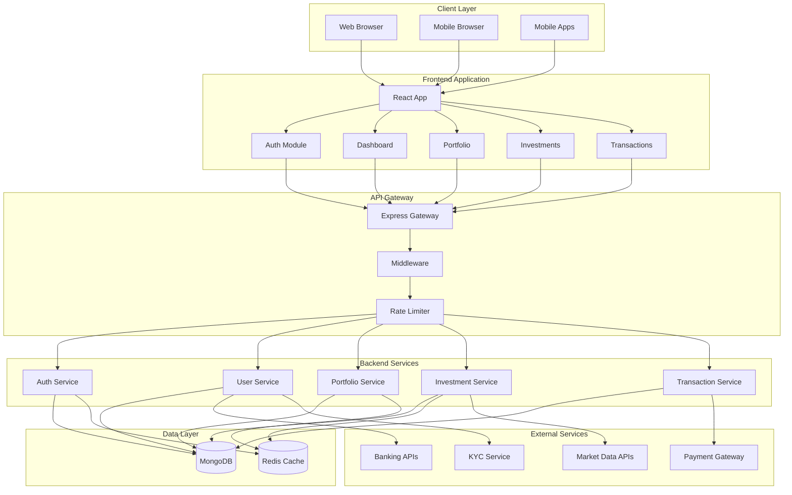
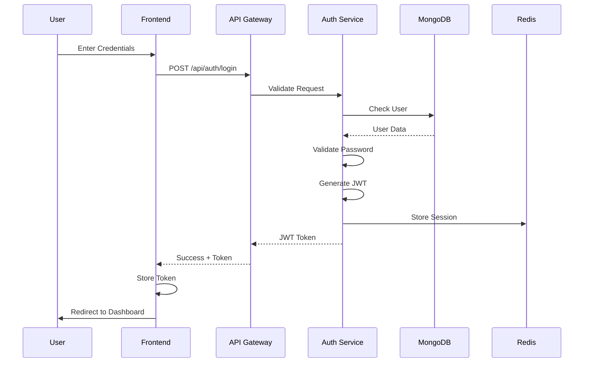
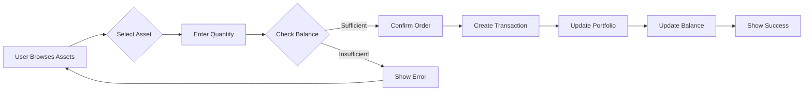
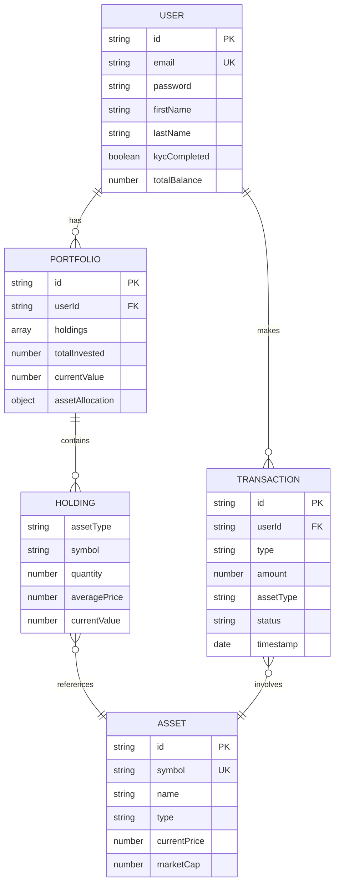
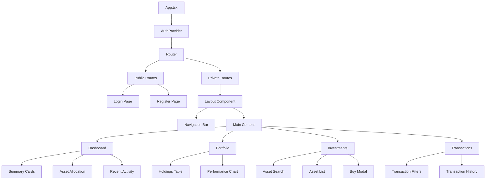
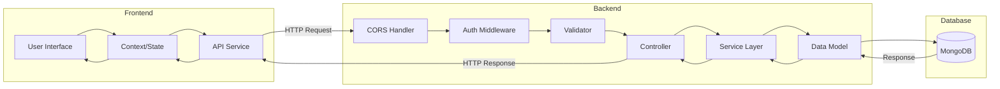
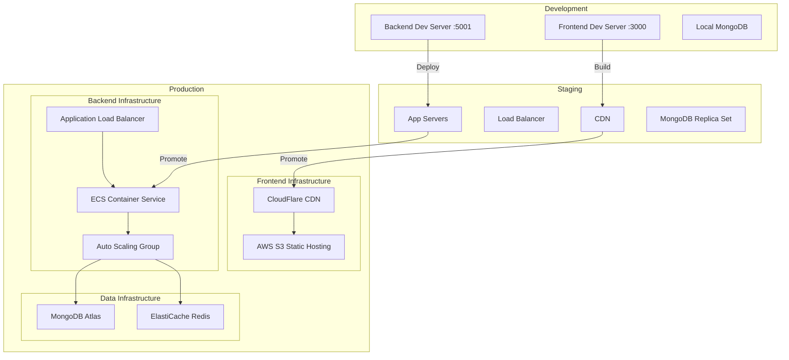
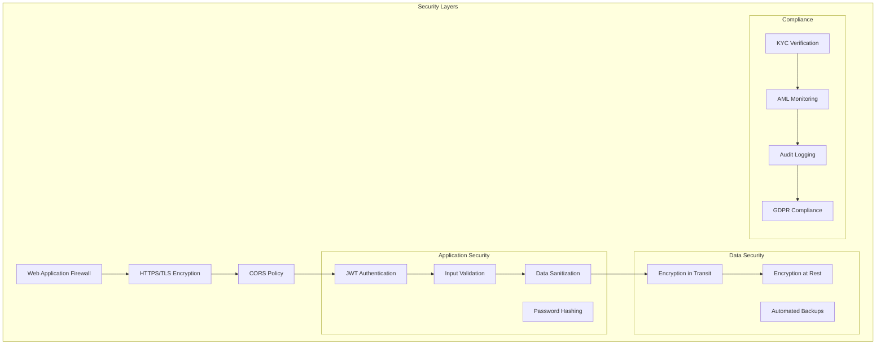
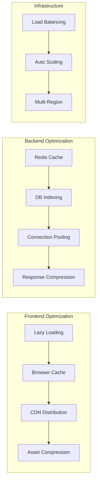
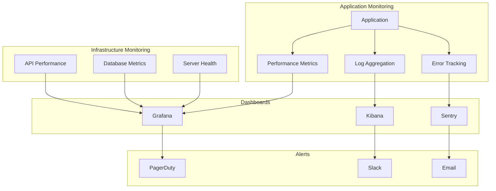

# WealthWise Architecture - Visual Diagrams

## 1. High-Level System Architecture

## 2. Authentication Flow Diagram

## 3. Investment Purchase Flow

## 4. Data Model Relationships

## 5. Component Hierarchy

## 6. API Request Flow

## 7. Deployment Architecture

## 8. Security Architecture

## 9. Performance Optimization Strategy

## 10. Monitoring & Observability

---

*Note: These diagrams can be rendered using Mermaid-compatible markdown viewers or converted to images using Mermaid CLI tools.*